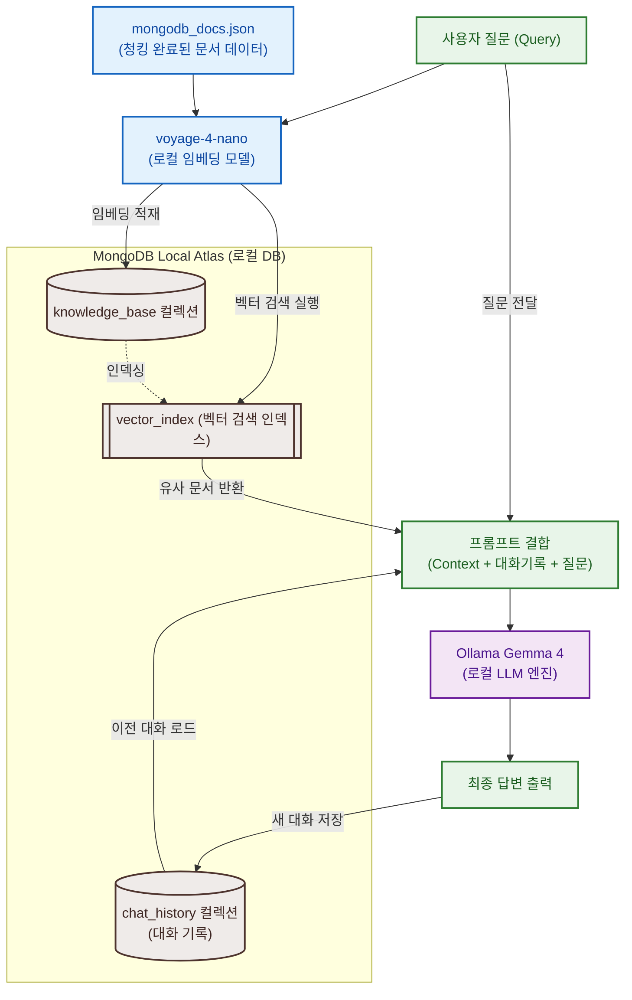

# Local RAG 핸즈온 Session 2

로컬 환경에서 RAG(Retrieval-Augmented Generation) 파이프라인을 처음부터 끝까지 구축합니다.
MongoDB Local Atlas, `voyageai/voyage-4-nano` (SentenceTransformers 로컬 실행), Ollama Gemma 4를 조합합니다.
**외부 API 키가 전혀 필요 없습니다.**

## 파일 구성

| 경로 | 설명 |
|---|---|
| `work/rag_pipeline.ipynb` | 메인 실습 노트북 |
| `work/pyproject.toml` | uv 의존성 정의 |
| `work/.env.example` | 환경변수 템플릿 |
| `data/mongodb_docs.json` | MongoDB 문서 스니펫 데이터셋 (20개 문서) |

---

## 사전 준비

노트북을 열기 전에 아래 단계를 순서대로 완료하세요.

### 필요한 것

Session 1 이후 이미 준비되어 있어야 합니다:

- Python 3.11+, `uv`, Ollama 및 로컬 Gemma 4 모델 (예: `gemma4:e2b` 또는 `gemma4:e4b`)

Session 2에서 추가로 필요한 것:

- **Docker** — Local Atlas가 내부적으로 Docker 컨테이너로 실행됩니다.
- **Atlas CLI** — Local Atlas 인스턴스를 생성하고 관리합니다.

---

### Step 1: Docker 설치 확인

```bash
docker --version
```

설치되어 있지 않으면: https://docs.docker.com/get-docker/

Docker Desktop을 설치한 경우 앱을 실행하여 데몬이 활성화되어 있는지 확인하세요.

---

### Step 2: Atlas CLI 설치

macOS (Homebrew):

```bash
brew install mongodb-atlas-cli
atlas --version
```

Windows / 다른 방법: https://www.mongodb.com/docs/atlas/cli/stable/install-atlas-cli/

---

### Step 3: Local Atlas 인스턴스 생성 및 시작

처음 실행 시 (Docker 이미지 다운로드 포함, 3~5분 소요):

```bash
# 최신 CLI에서는 아래 명령어로 로컬 아틀라스 인스턴스(예: local-rag)를 생성합니다.
atlas local setup local-rag
```

실행 시 나타나는 질문들은 다음과 같이 선택합니다:
* **setup 방식**: `With default settings` 선택 (기본값으로 구동)
* **연결 방식**: `Skip` 선택 (우리는 `.env`를 통해 수동으로 연결 예정)

이미 생성한 인스턴스를 다시 시작할 때:

```bash
atlas local start local-rag
```

실행 상태 및 포트 확인:

```bash
# 로컬 배포 목록과 실행 상태(STATE), 포트를 확인합니다.
atlas local list
```

연결 문자열 확인 (MongoDB 연결용 URI 및 포트 획득):

```bash
# 해당 인스턴스의 올바른 로컬 주소(Port 포함)를 출력합니다.
atlas local connect local-rag --connectWith connectionString
```

> [!IMPORTANT]
> 로컬 아틀라스는 구동 시 기본 포트인 `27017`가 점유중인 경우 임의의 빈 포트를 사용합니다.
> 반드시 위 `atlas local connect` 또는 `atlas local list` 명령어로 실제 할당된 URI 주소와 포트 번호를 조회한 뒤 사용하세요.

---

### Step 4: Ollama 모델 태그 확인

Ollama 설치 및 기본 설정은 Session 1에서 다루었으므로, 여기서는 사용하려는 Gemma 4 모델 태그명만 확인합니다.

```bash
# 로컬에 이미 다운로드받은 Ollama 모델명 목록을 확인합니다.
ollama list
```

`gemma4:e2b`가 표준이나, PC 사양에 맞춰 `gemma4:e4b` 등 자신이 다운로드한 Gemma 4 모델 태그명을 확인해 둡니다. (만약 없다면 `ollama pull gemma4:e2b` 등으로 가져옵니다.)

> [!IMPORTANT]
> 로컬 컴퓨터에 설치된 정확한 Gemma 모델명(태그 포함)을 기억해 두어야 하며, 이 태그명을 다음 Step 5의 `.env` 파일 내 `OLLAMA_MODEL` 변수값으로 정확히 지정해 주어야 정상 작동합니다.

---

### Step 5: .env 파일 준비

```bash
cp hands-on/session-2/work/.env.example hands-on/session-2/work/.env
```

`.env`를 열고 값을 채웁니다.

```dotenv
# MONGODB_URI는 반드시 Step 3에서 조회한 실제 로컬 아틀라스의 URI(Port 포함)로 지정해야 합니다.
MONGODB_URI=mongodb://127.0.0.1:<조회한포트>/?directConnection=true
OLLAMA_BASE_URL=http://localhost:11434

# OLLAMA_MODEL은 Step 4에서 확인한 로컬의 정확한 모델명(태그 포함)을 입력해야 합니다.
# (예시: gemma4:e2b 또는 gemma4:e4b 등)
OLLAMA_MODEL=<로컬설치모델명>
```

> [!WARNING]
> `?directConnection=true` 쿼리 파라미터가 누락되면, 로컬 아틀라스 내부 컨테이너의 프라이머리 주소를 해석하지 못해 타임아웃 에러가 발생할 수 있습니다. 반드시 해당 주소 파라미터를 그대로 유지해 주세요.

---

### Step 6: uv 환경 준비

```bash
cd hands-on/session-2/work
uv sync
```

이 명령어가 `pyproject.toml`을 읽어 `.venv`를 생성하고 필요한 패키지(예: `ipykernel`, `pymongo`, `google-genai` 등)를 모두 설치합니다.

---

### Step 7: 노트북 실행

실습은 **Antigravity IDE** 환경에서 진행됩니다. 직접 `.ipynb` 파일을 열고 커널을 연결해야 셀 실행 버튼이 활성화됩니다.

#### 확장 프로그램 확인
* **Jupyter** (`ms-toolsai.jupyter`) [필수]: 노트북 파일을 실행하기 위해 필요합니다. `rag_pipeline.ipynb` 파일을 열고 우측 상단의 **Select Kernel**(커널 선택)을 클릭한 뒤 나타나는 **`Install/Enable suggested extensions Python + Jupyter`** (전구 아이콘) 항목을 선택하여 자동 설치하는 것이 가장 정확하고 간편합니다.
* **MongoDB for VS Code** (`mongodb.mongodb-vscode`) [추천/선택]: 필수 사항은 아니지만, 설치해 두면 로컬 아틀라스에 적재된 데이터와 컬렉션을 IDE 내에서 바로 시각적으로 쿼리하고 모니터링할 수 있어 편리합니다. (IDE 왼쪽 **Extensions** 탭에서 ID 검색 후 설치)
* **Markdown Preview Mermaid Support** (`bierner.markdown-mermaid`) [추천/선택]: 마크다운 미리보기 화면에서 아래의 아키텍처 다이어그램(Mermaid)을 시각적인 그래픽으로 확인하고 싶을 때 설치합니다. (설치하지 않으면 단순 텍스트 코드로 보이며, IDE 왼쪽 **Extensions** 탭에서 ID 검색 후 설치)


#### 가상환경 커널 설정 방법

> [!TIP]
> **가장 빠르고 확실하게 가상환경 커널을 연동하는 방법:**
> 1. `work` 폴더 내부에서 `uv sync`를 실행하여 `.venv` 환경을 정상 생성합니다.
> 2. **에디터 창 새로고침 (가장 중요)**: Command Palette (`Ctrl + Shift + P` / Mac `Cmd + Shift + P`)를 열고 **`Developer: Reload Window`**를 입력하여 창을 새로고침(또는 에디터 재시작)합니다.
> 3. 새로고침 완료 후 `rag_pipeline.ipynb` 파일을 열고 우측 상단의 **Select Kernel**을 누르면, 자동으로 감지된 `.venv` 커널이 목록에 바로 표시됩니다. 클릭하여 연결하면 완료됩니다.

만약 위의 자동 감지가 제대로 되지 않는다면 아래의 수동 백업 방법을 시도해 보세요:

##### [수동 방법 A] 실습 폴더를 IDE로 직접 열기
* IDE 메뉴에서 **File ➔ Open Folder**를 클릭하여 하위 폴더인 `hands-on/session-2/work` 폴더를 단독으로 엽니다. 이 경우 IDE가 루트에 위치한 `.venv` 폴더를 즉시 스캔하여 커널 목록에 띄워줍니다.

##### [수동 방법 B] 명령 팔레트를 통해 파이썬 인터프리터 강제 등록
1. Command Palette (`Cmd + Shift + P`)를 열고 **`Python: Select Interpreter`**를 실행합니다.
2. **`Enter interpreter path...`**를 클릭합니다.
3. 왼쪽 탐색기에서 `hands-on/session-2/work/.venv/bin/python` (Windows는 `Scripts/python.exe`) 파일을 **우클릭 ➔ Copy Path (경로 복사)** 하여 입력창에 그대로 붙여넣고 엔터를 누릅니다.
4. 노트북 화면 우측 상단의 **Select Kernel** ➔ **Select Another Kernel...** ➔ **Python Environments**를 순서대로 클릭하여 등록된 가상환경을 연결합니다.


> [!TIP]
> **브라우저 기반 실행 백업:**
> IDE 환경 설정이 원활하지 않은 경우, 터미널에서 `uv run jupyter lab` 명령을 실행해 브라우저 환경에서 노트북을 열고 실습을 진행할 수 있습니다.

> `sentence-transformers` 첫 실행 시 `voyageai/voyage-4-nano` 모델을 HuggingFace에서 자동 다운로드합니다 (약 200MB, 최초 1회만 수행).

---

## 노트북 단계 요약

### RAG 파이프라인 아키텍처
전체 파이프라인의 데이터 적재(Ingestion) 및 질의응답(Query) 처리 흐름은 다음과 같습니다.




Antigravity IDE에서 `rag_pipeline.ipynb`를 열고 셀을 순서대로 실행합니다.

| Step | 내용 |
|---:|---|
| 1 | 설정 및 MongoDB 연결 확인 |
| 2 | 데이터 로드 (20개 MongoDB 문서) |
| 3 | 청킹 (RecursiveCharacterTextSplitter) |
| 4 | 임베딩 생성 (voyage-4-nano, 로컬) |
| 5 | MongoDB에 데이터 적재 |
| 6 | MongoDB Vector Search 인덱스 생성 |
| 7 | MongoDB Vector Search 테스트 ($vectorSearch) |
| 8 | 대화 기록 저장/불러오기 (Memory) |
| 9 | Gemma 4로 RAG 답변 생성 |

---

## 트러블슈팅

**Docker가 실행되지 않음**
* Docker Desktop 앱을 정상적으로 켰는지 확인하세요. 터미널에 `docker ps`를 입력했을 때 에러 없이 실행 중인 컨테이너 목록이 출력되어야 합니다.

**MongoDB 연결 실패 (Local Atlas 구동 확인)**
* 로컬 아틀라스 인스턴스가 활성화 상태인지 확인합니다:
  ```bash
  atlas local list
  ```
* 만약 `STATE`가 `IDLE`이거나 정지된 상태라면 아래 명령어로 시작합니다:
  ```bash
  atlas local start local-rag
  ```
  *(인스턴스 생성 시 다른 이름을 지정했다면 `local-rag` 대신 해당 이름을 입력해 주세요)*

**벡터 인덱스가 READY가 안 됨**
* Local Atlas에서 인덱스를 최초 생성할 때 내부적으로 1~2분이 소요될 수 있습니다. `wait_for_index()` 셀이 정상적으로 READY 상태가 될 때까지 폴링하며 대기하므로 안내 메시지를 지켜봐 주세요.
