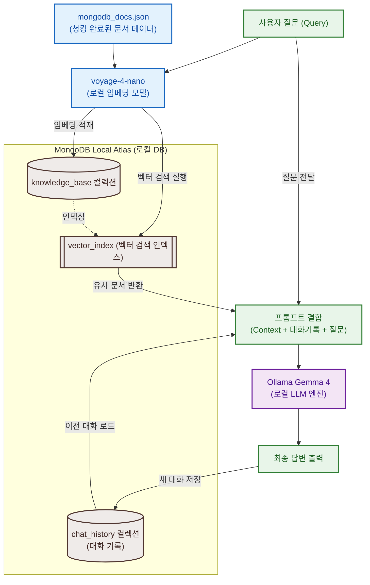

# Local RAG 핸즈온 Session 2

로컬 환경에서 RAG(Retrieval-Augmented Generation) 파이프라인을 처음부터 끝까지 구축합니다.
MongoDB Local Atlas, `voyageai/voyage-4-nano` (로컬 실행), Ollama Gemma 4를 조합합니다.
**외부 API 키가 전혀 필요 없습니다.**

> [!IMPORTANT]
> 이 문서는 **현장 실습** 가이드입니다. Docker 설치와 Atlas CLI 초기 구동은 [사전 준비 가이드](./prerequisites.md)를 먼저 완료하세요.

## 파일 구성

| 경로 | 설명 |
|---|---|
| `work/rag_pipeline.ipynb` | 메인 실습 노트북 |
| `work/pyproject.toml` | uv 의존성 정의 |
| `work/.env.example` | 환경변수 템플릿 |
| `data/mongodb_docs.json` | MongoDB 문서 스니펫 데이터셋 (20개 문서) |

---

## RAG 파이프라인 아키텍처

전체 파이프라인의 데이터 적재(Ingestion) 및 질의응답(Query) 처리 흐름입니다.



---

## 현장 실습

### Step 1: Local Atlas 인스턴스 확인 및 시작

```bash
atlas local list
```

`STATE`가 `IDLE`이거나 목록에 없으면 시작합니다.

```bash
atlas local start local-rag
```

연결 문자열을 확인합니다.

```bash
atlas local connect local-rag --connectWith connectionString
```

> [!IMPORTANT]
> Local Atlas는 기본 포트 `27017`이 이미 점유된 경우 임의의 빈 포트를 사용합니다. 반드시 위 명령으로 실제 URI와 포트를 확인한 뒤 다음 단계에서 사용하세요.

---

### Step 2: Ollama 모델 태그 확인

```bash
ollama list
```

`gemma4:e2b`가 기본이나, 자신의 사양에 맞게 준비한 태그를 확인합니다. 없으면:

```bash
ollama pull gemma4:e2b
```

> [!IMPORTANT]
> 확인한 정확한 모델 태그명을 다음 단계 `.env` 파일의 `OLLAMA_MODEL`에 입력해야 합니다.

---

### Step 3: .env 파일 준비

```bash
cp hands-on/session-2/work/.env.example hands-on/session-2/work/.env
```

`.env`를 열고 Step 1, 2에서 확인한 값을 채웁니다.

```dotenv
# Step 1에서 조회한 실제 URI (포트 포함)
MONGODB_URI=mongodb://127.0.0.1:<조회한포트>/?directConnection=true
OLLAMA_BASE_URL=http://localhost:11434
# Step 2에서 확인한 정확한 모델 태그
OLLAMA_MODEL=<로컬설치모델명>
```

> [!WARNING]
> `?directConnection=true`가 누락되면 로컬 Atlas 내부 컨테이너의 프라이머리 주소를 해석하지 못해 타임아웃이 발생합니다. 반드시 유지하세요.

---

### Step 4: 노트북 실행 환경 설정

실습은 **Antigravity IDE** 또는 Jupyter 노트북을 실행할 수 있는 기존 편집기 환경에서 진행합니다. Antigravity 2.0은 IDE와 분리된 에이전트 관리 앱이므로, 노트북 편집과 확장 프로그램 설치가 필요하면 Antigravity IDE 또는 VS Code를 준비하세요.

#### 확장 프로그램 설치

- **Jupyter** (`ms-toolsai.jupyter`) [필수]: `rag_pipeline.ipynb`를 열고 우측 상단 **Select Kernel** → **Install/Enable suggested extensions Python + Jupyter**를 선택해 설치합니다.
- **MongoDB for VS Code** (`mongodb.mongodb-vscode`) [추천]: 로컬 Atlas에 적재된 데이터와 컬렉션을 IDE 내에서 바로 조회하고 모니터링할 수 있습니다.
- **Markdown Preview Mermaid Support** (`bierner.markdown-mermaid`) [선택]: 위 아키텍처 다이어그램을 그래픽으로 확인하고 싶을 때 설치합니다.

#### 커널 연결

> [!TIP]
> 가장 빠른 방법: `uv sync` 완료 후 Command Palette (`Cmd + Shift + P`) → **Developer: Reload Window** → `rag_pipeline.ipynb` 열기 → **Select Kernel**에서 `.venv` 커널 선택.

자동 감지가 안 되면 **Python: Select Interpreter** → **Enter interpreter path** → `hands-on/session-2/work/.venv/bin/python` (Windows는 `Scripts/python.exe`) 경로를 직접 입력한 뒤 **Select Kernel** → **Select Another Kernel** → **Python Environments**에서 재선택합니다.

> [!TIP]
> IDE 환경 설정이 원활하지 않으면 터미널에서 `uv run jupyter lab`으로 브라우저 환경에서 노트북을 실행할 수 있습니다.

---

### Step 5: 노트북 실행

`rag_pipeline.ipynb`를 열고 셀을 순서대로 실행합니다.

| Step | 내용 |
|---:|---|
| 1 | 설정 및 MongoDB 연결 확인 |
| 2 | 데이터 로드 (20개 MongoDB 문서) |
| 3 | 청킹 (RecursiveCharacterTextSplitter) |
| 4 | 임베딩 생성 (voyage-4-nano, 로컬) |
| 5 | MongoDB에 데이터 적재 |
| 6 | MongoDB Vector Search 인덱스 생성 |
| 7 | MongoDB Vector Search 테스트 ($vectorSearch) |
| 8 | 대화 기록 저장/불러오기 (Memory) |
| 9 | Gemma 4로 RAG 답변 생성 |

> `sentence-transformers` 첫 실행 시 `voyageai/voyage-4-nano` 모델을 자동으로 다운로드합니다 (약 200MB, 최초 1회만 수행).

---

## 트러블슈팅

**MongoDB 연결 실패**

Local Atlas 인스턴스가 활성화 상태인지 확인합니다.

```bash
atlas local list
atlas local start local-rag
```

시작 후 `atlas local connect local-rag --connectWith connectionString`으로 URI를 다시 확인하고 `.env`에 반영하세요.

---

## 더 알아보기

- [MongoDB Vector Search 개요](https://www.mongodb.com/docs/atlas/atlas-vector-search/vector-search-overview/) — 임베딩 기반 시맨틱 검색의 동작 원리와 Atlas에서의 활용 방법
- [$vectorSearch 쿼리](https://www.mongodb.com/docs/atlas/atlas-vector-search/vector-search-stage/) — ANN/ENN 검색을 실행하는 집계 파이프라인 스테이지 레퍼런스
- [Vector Search 인덱스 구성](https://www.mongodb.com/docs/atlas/atlas-vector-search/vector-search-type/) — 벡터 필드에 인덱스를 정의하는 방법
- [The Voyage 4 model family](https://blog.voyageai.com/2026/01/15/voyage-4/) — voyage-4-nano가 속한 Voyage AI 공개 가중치 모델 패밀리 소개
- [voyageai/voyage-4-nano](https://huggingface.co/voyageai/voyage-4-nano) — HuggingFace 모델 카드 (아키텍처, 사용법, 벤치마크)
- [Voyage AI Text Embeddings](https://docs.voyageai.com/docs/embeddings) — Voyage AI 임베딩 모델 공식 문서
